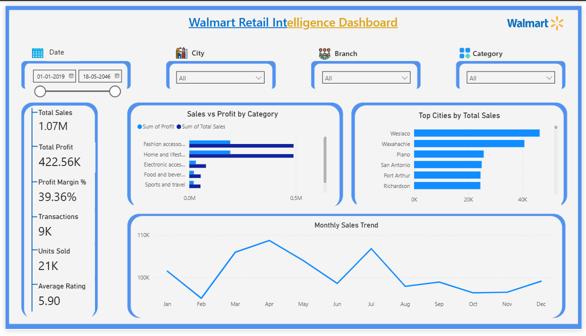
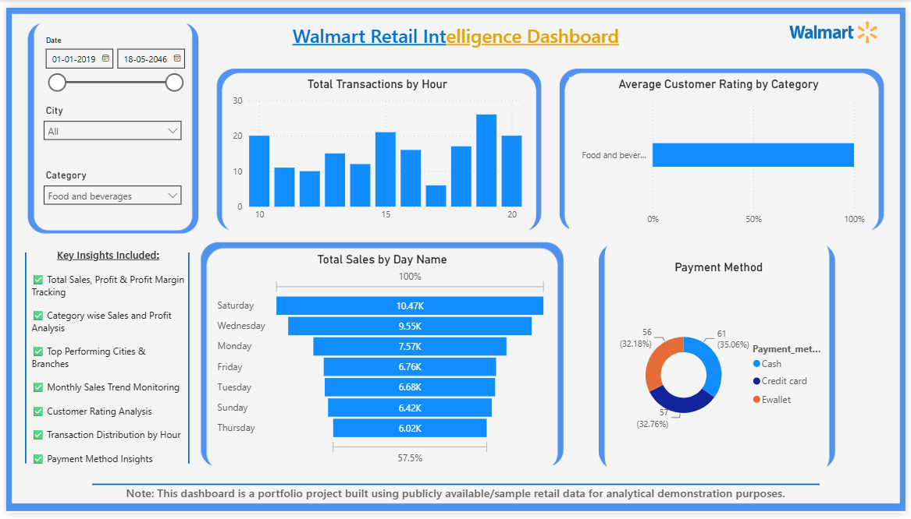

  

# 🛒 Walmart Retail Intelligence Dashboard

An end-to-end Business Intelligence project developed in Power BI to analyze Walmart retail sales performance, profitability, customer behavior, and transaction trends.

This project transforms raw retail transaction data sourced from Kaggle into actionable business insights through data cleaning in Excel, transformation in Power Query, DAX calculations, and interactive dashboard design in Power BI/ Illustrator.

---

# 🚀 Project Highlights

✔ Built a complete end-to-end Power BI Business Intelligence solution

✔ Collected retail transaction data from Kaggle and prepared it for analysis

✔ Performed data cleaning using Microsoft Excel and Power Query

✔ Created KPI measures using DAX for sales, profit, margin, and customer analysis

✔ Designed an Executive Overview dashboard for performance monitoring

✔ Developed a Customer Insights dashboard to analyze purchasing behavior

✔ Analyzed sales performance across categories, cities, and branches

✔ Identified peak transaction hours and customer payment preferences

✔ Applied data storytelling principles to transform data into business insights

✔ Developed interactive filtering using Date, City, Branch, and Category slicers

---

# 📌 Project Status

✅ Completed

This dashboard is fully functional and demonstrates the complete Business Intelligence workflow from data collection to insight generation.

---

# 📊 Dashboard Modules

### Executive Overview

Provides a high-level snapshot of business performance through:

- Total Sales Tracking
- Total Profit Analysis
- Profit Margin Monitoring
- Transaction Analysis
- Units Sold Tracking
- Monthly Sales Trend Analysis
- Category Performance Comparison
- Top Performing Cities Analysis

### Customer Insights

Provides customer-focused analytics including:

- Transaction Distribution by Hour
- Customer Rating Analysis
- Sales Performance by Day
- Payment Method Distribution
- Category wise Customer Satisfaction

---

# 🛠️ Tools & Technologies

- Power BI Desktop
- Power Query
- DAX
- Microsoft Excel
- Kaggle Dataset
- Illustrator For Background Design

---

# 🔄 End-to-End Workflow

1. Data Collection from Kaggle
2. Data Cleaning in Excel
3. Data Transformation in Power Query
4. Data Modeling in Power BI
5. DAX Measure Development
6. Insight Generation & Reporting
7. Dashboard Design & Development (Illustrator)

---

# 🎯 Business Questions Answered

- Which product categories generate the highest sales?
- Which cities contribute the most revenue?
- How does profit compare across categories?
- What are the monthly sales trends?
- Which payment methods are preferred by customers?
- When do transaction volumes peak?
- How do customer ratings vary across categories?
- Which weekdays generate the highest sales?

---

# 📈 Key Metrics Tracked

- Total Sales
- Total Profit
- Profit Margin %
- Total Transactions
- Units Sold
- Average Customer Rating

---

# 📷 Dashboard Preview

### Executive Overview

### Customer Insights

---

# 💡 Skills Demonstrated

### Business Intelligence

- KPI Development
- Dashboard Design
- Data Storytelling
- Interactive Reporting

### Data Analytics

- Sales Analysis
- Profitability Analysis
- Customer Behavior Analysis
- Trend Analysis

### Power BI

- Data Modeling
- Power Query
- DAX Measures
- Interactive Visualizations

---

# 👨‍💻 Author

### Uday Rari

Aspiring Data Analyst | Power BI | SQL | Python | Data Visualization

🔗 **[LinkedIn Profile](https://www.linkedin.com/in/udayrari/)**

🔗 **[GitHub Profile](https://github.com/YOUR_GITHUB_USERNAME)**

---

⭐ If you found this project interesting, feel free to explore the repository and share your feedback.
